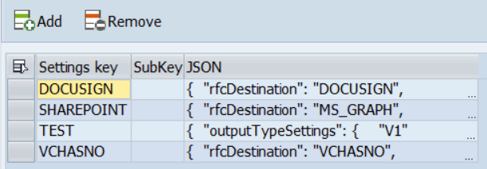
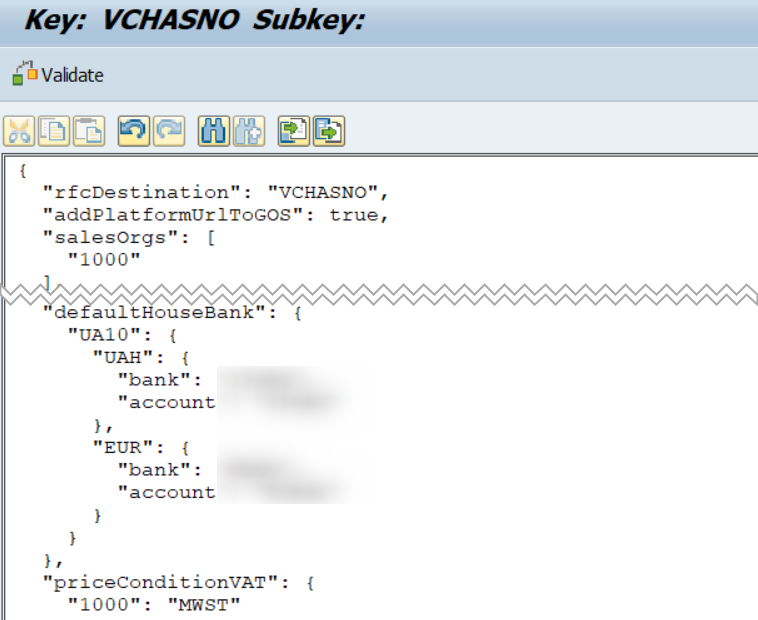

What do you do if you need to add configuration possibilities to your program? In most cases, you will probably create a DB table for those settings and a maintenance view for it. Maintenance views is a quite powerful and relatively simple tool. Yet they are not without downsides and complexity when your configuration has a hierarchical structure or/and when the structure is not yet final and changes frequently e.g. when you're developing a new product. How to achieve the flexibility you need in such a case?

<!-- truncate -->

One of the modern development patterns is to use JSON for configuration. Indeed, it is very flexible, not constrained. Any part of JSON can be easily addressed. Why not try using JSON in ABAP? I and my team are developing a tool for electronic document exchange services integration (like Docusign, SharePoint, and some others), the product is in active development and the configuration must stay flexible. Maybe it will be converted to maintenance views in the later stages, but for now, we need the flexibility. We don't want constant modifications of data dictionary and maintenance view regeneration to stop our pace. Here is what we came up with.

As storage for settings, we have a flat table with 3 fields.


Table structure

- 2 char keys - we used 2 for potential substructuring, but ... maybe it is an over-engineering. For now, we don't use the 2nd key, and probably 1 level is enough since the underlying JSON has a tree-like nature.
- The last table field is a string for JSON content.

That's all you need for a config of any complexity.

From the user perspective, we wrote a simple program, that shows the key-list in ALV and then opens the underlying JSON in a `cl_gui_textedit`. Nothing complex, I'm considering to open-source it, if there is an interest in it (though really no huge development behind this).



List of settings



Example of json config

As you can see the content is freely editable JSON text.

Finally, accessing the config parameters is done with a help of [ajson package](https://github.com/sbcgua/ajson). I wrote about it before - [AJSON – yet another abap json parser and serializer](/posts/2020-08-14---ajson---yet-another-abap-json-parser-and-serializer/). Since the original blog post, the library has matured and we use it in several productive tools which exchange the data with external APIs and web services. The tool is designed to be convenient for a developer, so the accessing code looks, for example, as follows:

```abap
data lo_json_settings type ref to zif_ajson.
data lv_printer_name  type string.

lo_json_settings = zcl_ede_settings_factory=>get_json( 'VCHASNO' ).
lv_printer_name = lo_json_settings->get(
    |/overridePrinterDefaults/{ cs_nast-kappl }/{ cs_nast-kschl }| ).
...
```

Where `zcl_ede_settings_factory` is a simple abstraction wrapper to read JSON blob from the table and parse it with ajson, the rest is purely ajson functionality.

Ajson is not just capable of reading simple values of course but also can read structures, tables, filter notes, etc. I won't go into details here, just mention that it was designed with the developer's convenience and typical JSON access patterns in mind. Please refer to the mentioned blog post above or to the library [documentation at Github](https://github.com/sbcgua/ajson).

Thus we've got a very flexible and easily maintainable configuration. Adding a new parameter takes minimal time and effort until the configuration shape is fully stable. No DDIC modifications, no broken maintenance views. Isn't it a paradise? Well, nothing perfect in the world ... 🙂

Pitfalls

... it is not without downsides to be aware of. Here is the list from the top of my head:

1) Validation. Maintenance views imply typical checks like record duplicates, domain values validation, and all this discipline stuff out of the box. In JSON, you have to write extra code for validation. Or implement something like JSON Schema (which I have in plans, though a bit lack of time recently). At the same time, the necessity of validation depends on the task. In our tools, we didn't face serious issues (unexpectedly to me), because of good code structure and later implicit checks of the selected and processed data. Well, anyway, validation is important.

2) Editability. `cl_gui_textedit` doesn't know anything about JSON and has no idea about syntax highlighting, tabulation, and stuff like that. Either it doesn't show domain values or search helps. Personally, I don't think this is a huge issue, configuration is done by technical people, it is their job to know, properly configure and test programs. Yet ... certainly far from ideal.

3) Self Documentation. In my opinion, this is perhaps the biggest drawback. When you open a structured interface like a maintenance view or clustered view, you kind of see the full picture, you won't forget to fill a tiny setting in the corner, you can F1 to read the doc about a particular parameter. Not sure how to solve this one in the long run, except with good external documentation. Maybe some fiory-based editor?

Anyway, the benefits of JSON are heavier than the drawbacks for our particular case, so I consider this approach a success for our current project.

I hope this was interesting for you. Tell me in the comments what do you think about it? Is it applicable to your projects? Are there any undescribed advantages and disadvantages? Should SAP built-in something like this in standard? 😉

P.S. _Originally posted at [SAP Community platform](https://community.sap.com/t5/application-development-and-automation-blog-posts/json-alternative-to-maintenance-views-in-abap/ba-p/13528908) on 2022-Jul-23._
